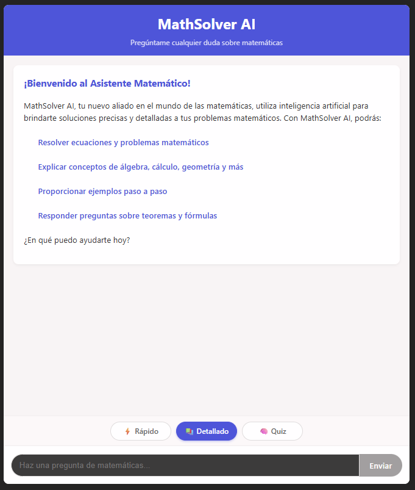
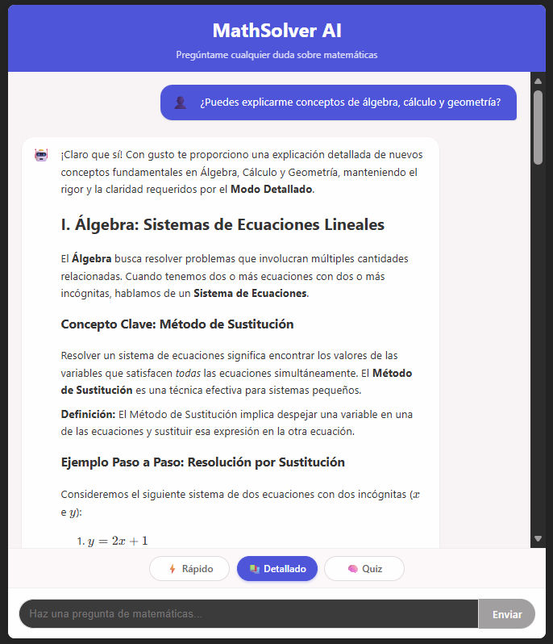
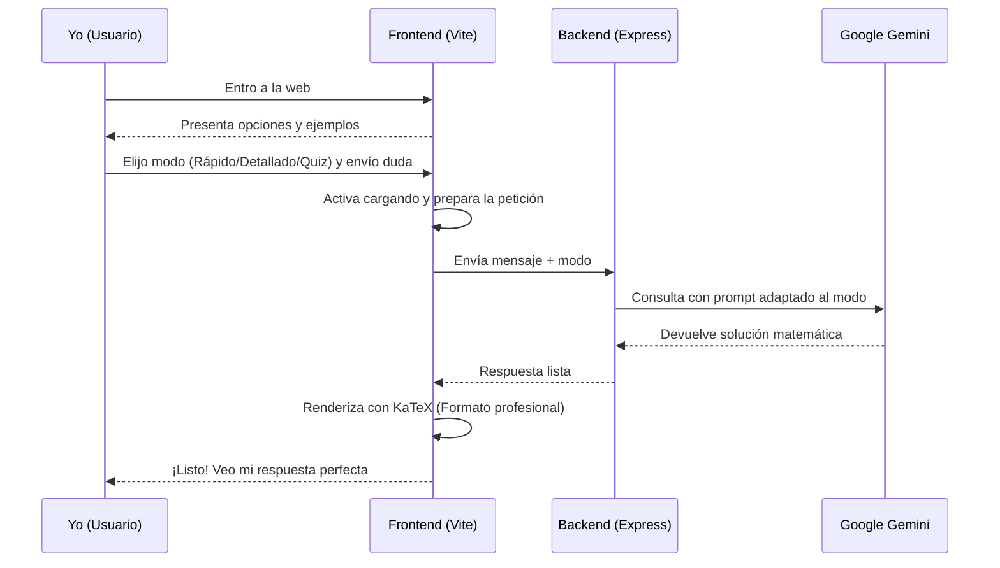
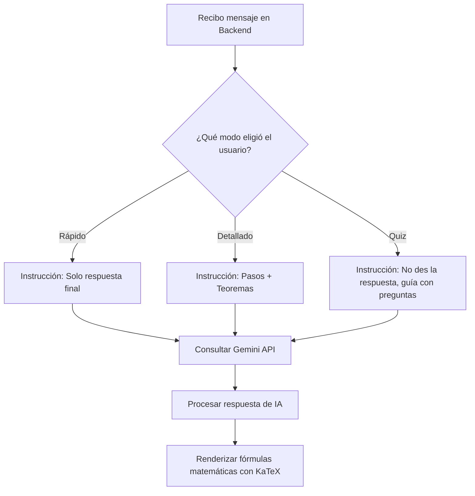

# MathSolver AI: Mi Asistente Matemático Personal

MathSolver AI no es solo un chat; es una herramienta diseñada para transformar cómo interactúo con las matemáticas. Desde resolver una derivada compleja hasta guiarme paso a paso como un tutor, este proyecto nació de la necesidad de tener precisión técnica y claridad pedagógica en un solo lugar.

---

## 🚀 Flujo de Usuario y Lógica

He diseñado el sistema para que sea intuitivo y potente. Aquí detallo cómo fluye la información desde que entro a la web hasta que obtengo mi resultado.

### Flujo de Interacción (User Flow)

Este diagrama muestra mi experiencia como usuario y cómo el sistema reacciona a mis acciones:

### Lógica Interna (System Flowchart)

Así es como el "cerebro" de la app decide cómo responder:

---

## 🤖 Ingeniería de Prompts (Prompt Engineering)

El corazón de la inteligencia de MathSolver AI reside en cómo nos comunicamos con el modelo. He aplicado técnicas avanzadas de **Prompt Engineering** para asegurar que las respuestas sean precisas y útiles.

### 1. System Prompt (Personalidad y Reglas)

He definido un "System Prompt" robusto que actúa como la constitución del asistente. Establece:

* **Rol:** "Tutor Experto en Matemáticas".
* **Proceso de Pensamiento:** Antes de responder, el modelo debe internamente categorizar el problema y detectar el nivel del usuario.
* **Reglas Estrictas:** Solo responder sobre matemáticas. Si el usuario pregunta algo fuera de este dominio, el asistente declina educadamente con un mensaje predefinido.
* **Formateo Literario:** Obligatoriedad de usar delimitadores LaTeX `$ ... $` y `$$ ... $$` para que el frontend pueda renderizarlos.

### 2. Instrucciones Dinámicas (Few-Shot & Role-Play)

Dependiendo del modo seleccionado, el backend inyecta una instrucción específica al principio de la consulta:

* **Modo Rápido:** *Constraint Prompting* para forzar una respuesta mínima y directa.
* **Modo Detallado:** *Chain-of-Thought (CoT)* inducido, pidiendo explícitamente el paso a paso y la mención de teoremas.
* **Modo Quiz:** *Socratic Prompting*, prohibiendo dar la respuesta y obligando al modelo a guiar al usuario con preguntas estratégicas.

---

## 🧠 Decisiones y Arquitectura: "El Porqué de las Cosas"

### ¿Por qué tres modos de respuesta?

Me di cuenta de que no siempre busco lo mismo. A veces solo quiero confirmar un resultado (**Rápido**), otras necesito estudiar para un examen (**Detallado**) y otras quiero que me pongan a prueba (**Quiz**). Al separar estos "prompts" en el backend, logro que la IA se comporte exactamente como necesito sin que yo tenga que escribir instrucciones largas cada vez.

### ¿Por qué KaTeX y ReactMarkdown?

Nada me frustra más que ver fórmulas en texto plano como `x^2/sqrt(y)`. Quería que las expresiones se vieran como en un libro de texto. Elegí KaTeX por su velocidad y lo integré con Markdown para poder tener explicaciones ricas en texto combinadas con matemáticas impecables.

### Decisiones Técnicas

* Vite: Para un desarrollo instantáneo y una build ligera.
* Express: Para tener un puente seguro y escalable hacia la API de Google Gemini.
* Google Gemini (Flash): Por su increíble balance entre velocidad y razonamiento lógico-matemático.

---

## ⏱️ Gestión de Tiempos y Prioridades

No me enfoqué solo en "features", sino en **valor**.

1. **Prioridad 1 (Core):** Asegurar que la lógica matemática fuera sólida. No sirve de nada una interfaz bonita si el resultado es incorrecto.
2. **Prioridad 2 (UX):** El selector de modos. Sabía que esto me ahorraría tiempo a largo plazo al interactuar con la IA.
3. **Prioridad 3 (Estética):** El renderizado de KaTeX. Es el "toque final" que hace que el proyecto se sienta profesional.

*Si hubiera tenido menos tiempo, habría sacrificado los estilos avanzados antes que la precisión de la IA.*

---

## 🔄 Retrospectiva: Si empezara de nuevo

Si tuviera que reconstruir MathSolver AI desde cero, cambiaría un par de cosas:

* **Base de Datos:** Implementaría un historial de chats (MongoDB o similar) para no perder mis sesiones al refrescar.
* **Autenticación:** Añadiría un sistema de usuarios desde el día uno para personalizar aún más la experiencia de aprendizaje.
* **Subida de Imágenes:** Integraría visión artificial para poder enviarle una foto de mi cuaderno en lugar de escribir la ecuación.

---

## 🛠️ Detrás del Código: Mi Narrativa

Cuando programé el backend, mi reto fue hacer que el `SYSTEM_PROMPT` fuera lo suficientemente estricto para que la IA no se saliera del mundo de las matemáticas. Lo configuré para que actuara como un tutor experto, no solo como una calculadora. En el frontend, luché un poco con el CSS para que el chat se sintiera fluido en móviles, porque sé que muchas veces consultaré mis dudas desde el teléfono mientras estudio en mi escritorio.

---

## 🔧 Instalación y Despliegue

1. Clonar: `git clone https://github.com/lozadandres/MathSolver_AI.git`
2. Backend:
    * `npm install`
    * Crear `.env` con `OPENAI_API_KEY` (usamos Gemini, pero la variable mantiene el nombre por compatibilidad).
    * `node app.js`
3. Frontend:
    * `cd frontend && npm install && npm run dev`

---

## 📝 Licencia

Este proyecto es libre de uso bajo la licencia MIT.
